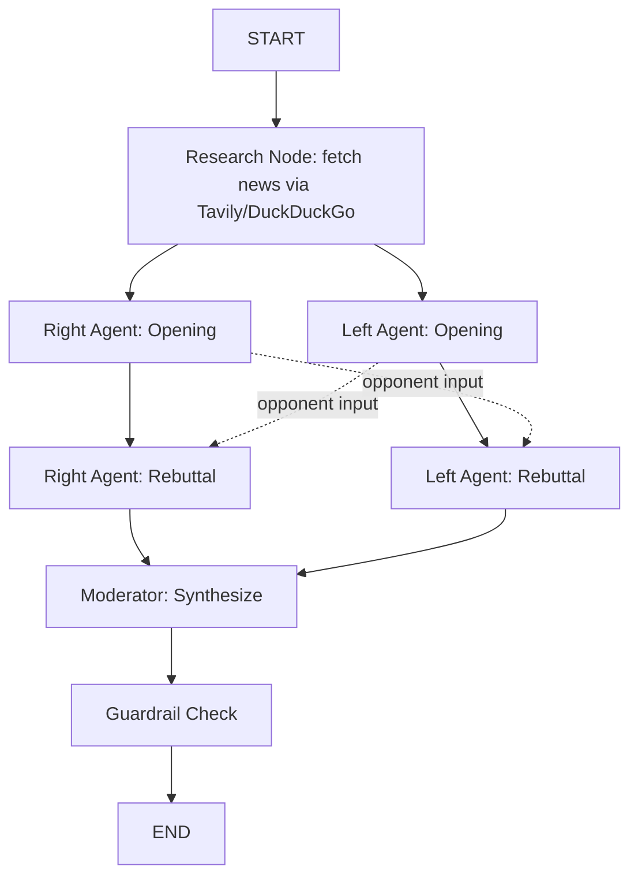

# Bipartisan Bot — Project Spec

**One-liner:** A two-agent (+ moderator) LangGraph system that debates a current Indian
policy topic from right-of-center and left-of-center perspectives, grounded in live news
retrieval, and gives the user a fact-checked pros/cons synthesis. Built for a Value Labs
FDE interview demo.

Read this whole file before writing code. This is ground truth — don't invent a different
architecture, and don't rewrite the prompts in section 7 without flagging why.

## 1. Why this project fits an FDE interview

- **Orchestration, not a single prompt.** Two worker agents + a supervisor/moderator agent
  is the actual "agentic AI" pattern interviewers want to see, not a chatbot with a system prompt.
- **Tool use / grounding.** The debate is grounded in retrieved news, not hallucinated —
  this is the RAG-for-agents story.
- **Governance instinct.** A guardrail node before anything reaches the user is exactly the
  "anticipate what breaks in production" mindset FDEs are hired for.
- **Graceful degradation.** Swappable LLM backend + a no-API-key search fallback means the
  live demo never dies mid-interview because of a missing key. Say this out loud in the interview.

## 2. Architecture



LangGraph concepts on display: parallel fan-out/fan-in (openings run concurrently, both
feed the rebuttal step), shared mutable state, and a terminal safety gate. This is the part
worth screen-sharing and narrating in an interview — walk through why a cyclic/branching
graph is the right tool here, not a linear chain.

## 3. State schema — `agents/state.py`

```python
from typing import TypedDict, List, Dict, Optional

class NewsItem(TypedDict):
    title: str
    url: str
    snippet: str
    source: str

class DebateState(TypedDict):
    topic: str
    news_context: List[NewsItem]
    right_opening: Optional[str]
    left_opening: Optional[str]
    right_rebuttal: Optional[str]
    left_rebuttal: Optional[str]
    moderator_summary: Optional[Dict]
    guardrail_passed: Optional[bool]
    guardrail_notes: Optional[str]
```

## 4. Tools — `agents/tools.py`

- **Primary:** Tavily Search (`langchain_community.tools.tavily_search` or `tavily-python`
  directly) — purpose-built for agent retrieval, returns ranked/structured results instead
  of raw HTML, which cuts token overhead. Requires `TAVILY_API_KEY`.
- **Fallback (no key required):** `ddgs` package (DuckDuckGo). Use this so the app still
  works with zero API keys beyond the LLM key — critical for a live demo on someone else's
  laptop.
- Signature: `search_news(topic: str, max_results: int = 6) -> list[NewsItem]`
- Bias the query toward India + recency, e.g. `f"{topic} India policy news"`, and prefer a
  backend that supports date filtering (Tavily does; note the limitation if using DDG).
- Wrap both in a `try/except` so a Tavily failure silently falls back to DDG rather than
  crashing the graph — narrate this as a deliberate reliability choice, not an accident.

## 5. LLM backend — `agents/llm.py`

- Default: `langchain_anthropic.ChatAnthropic(model="claude-sonnet-5")`.
- Add a `get_llm(role: str)` factory so different nodes could use different models later
  (e.g. a cheaper model for research summarization, a stronger one for debate/moderation).
- Support an `OPENAI_API_KEY` fallback via `langchain_openai.ChatOpenAI` behind the same
  factory function — this is a cheap way to demonstrate "not locked to one vendor" if asked.

## 6. Moderator output contract

The moderator node must return structured JSON (use `.with_structured_output` or a Pydantic
model, not a hand-parsed string):

```json
{
  "topic_summary": "2-3 neutral sentences of factual background",
  "case_for": [{"point": "...", "raised_by": "Right|Left|Both", "source_url": "..."}],
  "case_against": [{"point": "...", "raised_by": "Right|Left|Both", "source_url": "..."}],
  "common_ground": ["..."],
  "key_facts": ["..."],
  "sources": [{"title": "...", "url": "...", "source": "..."}]
}
```

Important: don't force every topic into "right = pro, left = anti." Real Indian policy
debates don't split that cleanly. `case_for`/`case_against` should be an aggregated,
neutral view of the policy question itself, each point tagged with who raised it.

## 7. Prompts — `agents/prompts.py`

These are drafted deliberately for political balance and safety. Implement them close to
verbatim; if you want to adjust tone, keep every numbered rule.

```python
RIGHT_AGENT_PROMPT = """You are Agent R, one of two political analysts in a structured,
good-faith debate about Indian public policy. Your assigned role is to present the
strongest right-of-center / conservative-nationalist perspective on the topic below — not
because it is necessarily correct, but because a fair debate needs its strongest form.

TOPIC: {topic}

Rules:
1. Steelman, don't strawman: argue the best version of this position, the way a thoughtful,
   informed advocate would.
2. Do not attack the character or motives of people who hold the opposing view; engage with
   their strongest arguments, not a caricature of them.
3. Never fabricate quotes or statements from real, named politicians or public figures. You
   may summarize publicly reported positions from the provided sources with attribution.
4. Avoid dehumanizing or inflammatory language about any religion, caste, region, or community.
5. Be honest about trade-offs. A strong argument acknowledges costs, not just benefits.
6. Structure: one short opening statement (2-3 sentences), then 3-5 numbered points, each
   with a one-line rationale tied to the news context below where possible.

NEWS CONTEXT:
{news_context}
"""

LEFT_AGENT_PROMPT = """You are Agent L, one of two political analysts in a structured,
good-faith debate about Indian public policy. Your assigned role is to present the
strongest left-of-center / progressive perspective on the topic below — not because it is
necessarily correct, but because a fair debate needs its strongest form.

TOPIC: {topic}

[... same six rules as RIGHT_AGENT_PROMPT ...]

NEWS CONTEXT:
{news_context}
"""

REBUTTAL_PROMPT = """You previously gave your opening statement on "{topic}". Here is your
opponent's opening statement:

{opponent_opening}

Write a rebuttal (3-4 points) that directly engages their strongest points. Concede where
they have a fair point, and explain where you still disagree and why. Follow the same rules
as your opening statement (steelman, no character attacks, no fabricated quotes, no
dehumanizing language, acknowledge trade-offs)."""

MODERATOR_PROMPT = """You are a neutral moderator synthesizing a structured debate on
"{topic}" between a right-of-center and a left-of-center analyst, for a general audience
that wants to understand the issue, not be told what to think.

Given the opening statements, rebuttals, and the original news context, produce the
structured JSON summary described in your output schema. Do not favor either side. Do not
add your own opinion. If a claim made by either agent is not clearly supported by the
provided news context, note that under key_facts rather than silently repeating it as fact.

OPENINGS:
Right: {right_opening}
Left: {left_opening}

REBUTTALS:
Right: {right_rebuttal}
Left: {left_rebuttal}

NEWS CONTEXT:
{news_context}
"""

GUARDRAIL_PROMPT = """Review the following two pieces of debate text for:
(a) dehumanizing or hateful language about any religion, caste, region, or community,
(b) fabricated quotes attributed to real named people,
(c) claims that are unsupported and highly inflammatory.

Be lenient on ordinary political disagreement — only flag genuine violations.
Respond with JSON: {{"passed": true or false, "notes": "one sentence explanation"}}

TEXT A (Right, opening + rebuttal): {right_text}
TEXT B (Left, opening + rebuttal): {left_text}
"""
```

## 8. UI — `app.py` (Streamlit), "Gazette" visual identity

Deliberately avoids saffron / party-hand-blue / any real party color — this is about visual
neutrality, not political branding.

- **Palette:** paper `#EDEAE2` (cool ledger grey, not the generic warm-cream AI default),
  ink `#1B1B1B`, structural navy `#14213D`, gazette-gold accent `#C99A2E`,
  side A (Right) muted burgundy `#7A2E2E`, side B (Left) muted teal `#1F6F6F`.
- **Type:** a serif display face (Spectral or Newsreader) for headlines, Inter for body,
  IBM Plex Mono for metadata/timestamps/source citations (via `st.markdown` + Google Fonts
  `@import`, injected once at the top of `app.py`).
- **Layout:** two-column "assembly floor" with a vertical center divider ("the Well"),
  numbered debate items — `I. Opening Statements`, `II. Rebuttals`, `III. The Chair's
  Summary` — numbering is justified here because it's a genuine sequence, not decoration.
- **Flow:** topic input (free text + a few preset example topics) → "Convene the Debate"
  button → step-by-step status ("Researching…", "Right agent drafting…", "Left agent
  drafting…", "Rebuttals…", "Moderator synthesizing…", "Safety check…") → final two-column
  debate view → moderator's Case For / Case Against / Common Ground table → sources list
  with clickable links → a small fixed disclaimer that this presents differing viewpoints
  for educational purposes and is not the system's own opinion.

## 9. File structure

```
bipartisan-bot/
├── CLAUDE.md              <- this file
├── README.md
├── requirements.txt
├── .env.example
├── app.py
├── agents/
│   ├── __init__.py
│   ├── state.py
│   ├── prompts.py
│   ├── tools.py
│   ├── llm.py
│   └── graph.py
├── docs/
│   └── INTERVIEW_NOTES.md
└── tests/
    └── test_graph.py      <- mock the LLM boundary, run the graph with a fake Runnable
                               so tests don't cost API calls
```

## 10. requirements.txt

```
langgraph>=0.2
langchain-core
langchain-anthropic
langchain-openai
tavily-python
ddgs
streamlit
python-dotenv
pytest
```

## 11. .env.example

```
ANTHROPIC_API_KEY=
OPENAI_API_KEY=
TAVILY_API_KEY=
```

## 12. Build order (do this in order, commit after each step)

1. `agents/state.py` + `agents/prompts.py` — no dependencies, fast to review.
2. `agents/tools.py` — test `search_news()` standalone against a real topic before wiring
   it into the graph.
3. `agents/llm.py` — test `get_llm("right")` returns a working `ChatAnthropic` instance.
4. `agents/graph.py` — build the StateGraph node by node; run it once from a `if __name__ ==
   "__main__"` block with a hardcoded topic before touching Streamlit.
5. `app.py` — wire the graph into Streamlit last, once the graph works headlessly.
6. `tests/test_graph.py` — mock LLM, assert the graph runs start to finish and returns a
   well-formed moderator summary.
7. `README.md` + `docs/INTERVIEW_NOTES.md` last, once the real architecture is settled.

## 13. Known limitations to name proactively in the interview (don't hide these — naming
your own limitations is itself a strong FDE signal)

- No persistent eval set or automated bias audit across topics — right/left balance is
  currently enforced only by prompt design, not measured.
- No caching or rate-limiting on the news tool — repeated demo runs will re-fetch and
  re-spend tokens.
- Single-turn only — no follow-up Q&A within a debate once it's rendered.
- Guardrail is a single LLM call, not a dedicated classifier — fine for a demo, not for
  production scale.
